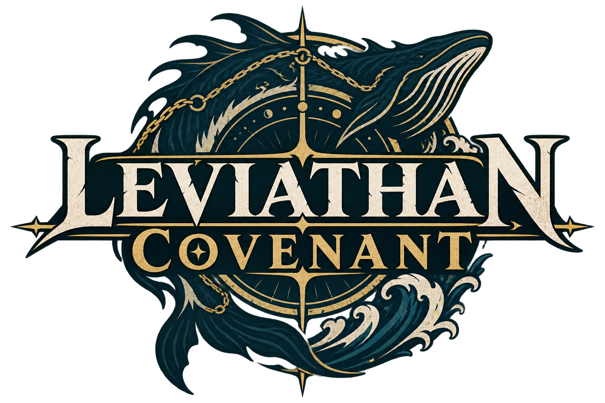
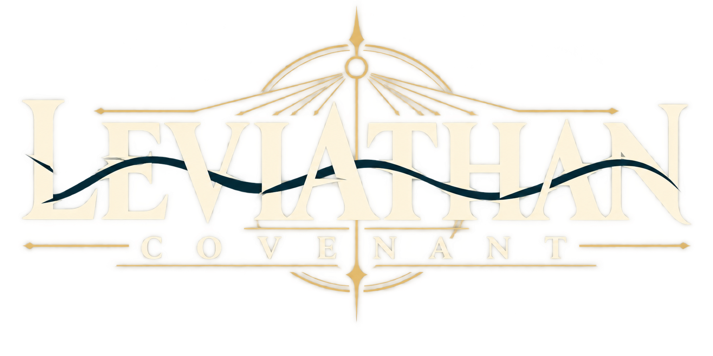
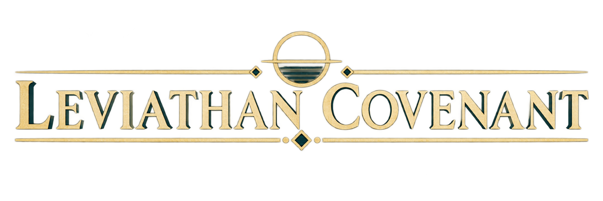

# 『LEVIATHAN COVENANT』タイトルロゴ提案

## 決定事項

- 正式タイトル表記は、空白を含む大文字の `LEVIATHAN COVENANT` とする。
- 日本語副題は正式題へ含めず、開始画面の説明文として「一人から国を奪る年代記。」を残す。
- リポジトリ名、保存キー、音響設定キーなどの内部識別子は、互換性を守るため今回変更しない。
- ロゴ案は比較提案の段階とし、正式採用までは開始画面を文字組みで表示する。

## 作品核から導いた共通要件

ロゴは、単純な怪獣討伐作品ではなく、リヴァイアサンという世界規模の自然、国家を束ねる社会契約、女神との契約、専制と多元主義の分岐を同時に扱う作品だと伝える必要がある。現行UIの深い青緑、古金、象牙色へ合わせ、横向きスマートフォンの開始画面でも読める横長構成とした。

## A｜Abyssal Seal（深淵の盟約印）

- 巨大海獣、方位環、盟約を結ぶ線を一つの紋章へ統合した、物語性の最も強い案。
- リヴァイアサンの存在が一目で伝わり、キービジュアル、ストア画像、告知素材に強い。
- 小型表示では図像が密になるため、ゲーム内ヘッダーより大画面用途へ向く。

## B｜Sovereign Compact（主権者の盟約）— 推薦

- 公印を思わせる円環と一本の深海色の波を、読みやすい二段の文字組みへ統合した案。
- 海獣を直接描かず、討伐・和解のどちらの終局にも偏らない。
- 現行開始画面の深い青緑と古金の配色に最も自然に入り、420px前後でも題名が判別しやすい。

## C｜Covenant Ledger（盟約台帳）

- 条約文、年代記、国家台帳を連想させる碑文型の横長案。
- 政治・制度・歴史のシミュレーション性が最も強く、狭い横長領域へ配置しやすい。
- リヴァイアサンの物語的存在感は控えめなため、単独ロゴよりUIヘッダーや章扉へ向く。

## 推薦と採用後の仕上げ

正式ロゴには B を推薦する。作品の二つの終局を損なわず、開始画面での視認性、現行UIとの色調、国家・契約・海の三要素の均衡が最もよい。採用時は生成案をそのまま最終入稿にせず、文字輪郭、カーニング、円環の線幅をSVGで再作図し、横長・小型・単色の三ロックアップを用意する。

## 生成仕様

3案とも内蔵画像生成を使い、正式表記を一度だけ正確に入れること、透過背景、古金・象牙・深い青緑、横長、3D・モックアップ・透かしなしを共通条件とした。Aは海獣と盟約印、Bは公印と抽象的な波、Cは碑文と台帳を個別の主題とした。
